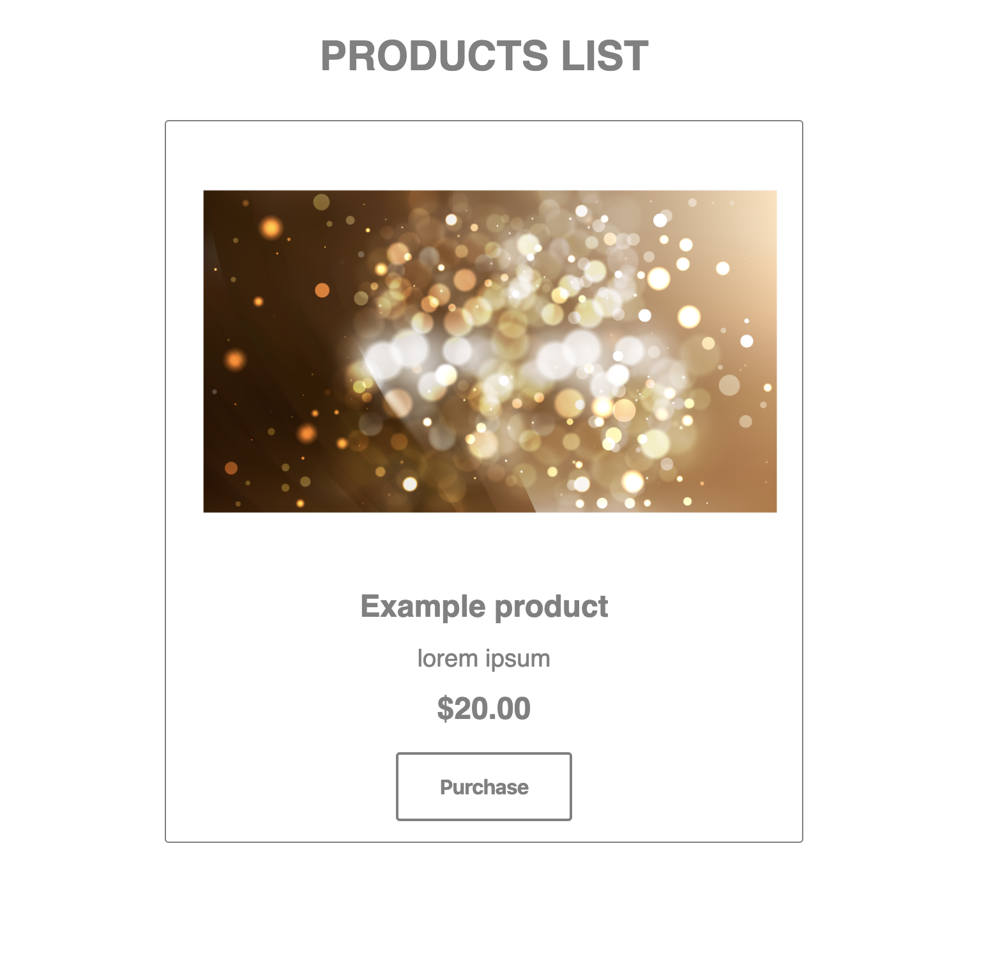
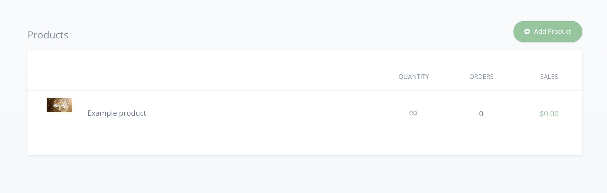

# Integration guide to list products on a webpage with React.js and Commerce.js SDK

Integration guide to list products on a webpage using React and Commerce.js SDK V2.

[Live Demo](https://flamboyant-visvesvaraya-243cf6.netlify.com/)



## Overview

- This guide is designed to walk you through the integration of commerce.js SDK with React. 
- [Commerce.js](https://commercejs.com/) is a tool that helps you develop custom e-commerce websites without the need to rely on e-commerce CMS.
- It's simple, fast and efficient taking out the headache that comes with the complex functionalities needed usually to develop an e-commerce website, giving you the ability to make a customized online store easily.

### Requirements

We'll need the following tools to be installed
- Your favorite code editor ([VSC](https://code.visualstudio.com/) in my case)
- [NodeJS](https://nodejs.org/en/)
- [NPM](https://www.npmjs.com/) or [Yarn](https://yarnpkg.com/)
- [ReactJS](https://reactjs.org/)
- [Commerce.js](https://commercejs.com/)
- [SCSS](https://sass-lang.com/)

### Prerequisites

To follow along you need to have some knowledge in
- JavaScript
- React
- CSS/SCSS


### Getting started

1- First you have to create an account on Chec platform, you can do that [here](https://authorize.chec.io/signup).
2- On the dashboard click Add Product and add your desired products filling up the title, description, price, uploading images and choosing the desired shipping methods and settings.
3- Click on **Setup**, then **Developer** and get your **public key** to use in the app you're going to develop.
4- Create a React app and set the initial files up.



### Installing Commerce.js

Use our Commerce.js SDK to access the Chec API data from your application.

*Choose either one of the installation methods:* 

1. Installing via CDN

```html
  <script type="text/javascript" src="https://assets.chec-cdn.com/v2/commerce.js"></script>
```

2. Installing via SDK

```
  npm install @chec/commerce.js
```

### Project usage

After installing Commerce.js now you need to set up an instance and get the data from it.

1. First import Commerce.js and make an instance using your **API KEY** then save the data it returns to the state

```javascript
  import React, { Component } from 'react';
  import Commerce from '@chec/commerce.js';
  import Product from './Product';

  class Products extends React {
    constructor() {
      super();
      this.state = {
        products: null,
      }
    }

    componentDidMount() {
      const commerce = new Commerce('YOU_APP_KEY_HERE');

      commerce.products.list()
        .then(res => {
          this.setState({products: res.data})
        })
        .catch(err => console.log(err))
    }
  }
```

2. Create a **Product** component then pass the data using props

```javascript
      return (
      <>
        <h1 className="products">Products list</h1>
        {products 
          ? products.map(product => (
              <Product 
                key={product.id} 
                name={product.name} 
                image={product.media.source} 
                price={product.price.formatted_with_symbol} 
                description={product.description.replace(/(<([^>]+)>)/ig,"")} 
              />
            ))
          : 'Porducts not available yet'}
      </>
    );
```

3. Set up the **Product** component and make it ready for display

```javascript
  const Product = ({ name, image, description, price }) => (
    <div className="card">
      
      <h3 className='card__name'>{name}</h3>
      <p className="card__description">{description}</p>
      <h4 className="card__price">{price}</h4>
      <button className="card__button">Purchase</button>
    </div>
  );
```

4. Use your own CSS/SCSS styles to customize the look and feel of the component

```css
  .card {
  border: 1px solid gray;
  width: 500px;
  max-height: 1000px;
  margin: 2rem auto;
  padding: 1rem;
  border-radius: 3px;
  text-align: center;

  &__image {
    max-width: 100%;
    margin: 0;
  }

  &__name,
  &__description,
  &__price {
    color: gray;
    font-family: sans-serif;
    line-height: 1.5;
    margin-bottom: .5rem;
  }

  &__name {
    font-size: 1.5rem;
  }
  
  &__description {
    font-size: 1.2rem;
  }
  
  &__price {
    font-size: 1.5rem;
    margin-bottom: 1rem;
  }

  &__button {
    padding: 1rem 2rem;
    background-color: transparent;
    color: gray;
    border-radius: 3px;
    border: 2px solid gray;
    font-weight: bold;
    font-size: 16px;
    transition: all .3s;
    cursor: pointer;

      &:hover {
        background-color: gray;
        color: white;
      }
    }
  }
```

### Conclusion

That's all you need to start building your next customized e-commerce website easily, it was quick and straightforward without any added complexity.

**To summarize:**

- Created a **Chec** account, got the **API KEY** and added the products.
- Created a React app and installed Commerce.js.
- Made an instance of the commerce object with our Chec products data using the **API KEY**.
- Displayed the data on the page and styled it.

You could find the final result [on here](https://flamboyant-visvesvaraya-243cf6.netlify.com/).

[Link to the API Docs](https://commercejs.com/docs/api/?javascript#list-all-products)

## Built With

* [NodeJS](https://nodejs.org/en/)
* [NPM](https://www.npmjs.com/) or [Yarn](https://yarnpkg.com/)
* [ReactJS](https://reactjs.org/)
* [Commerce.js](https://commercejs.com/)
* [SCSS](https://sass-lang.com/)

## Authors

* **Radouane Khiri** - [Github](https://github.com/Redvanisation) | [LinkedIn](https://www.linkedin.com/in/redvan/).

See also the list of [contributors](https://github.com/your/project/contributors) who participated in this project.
